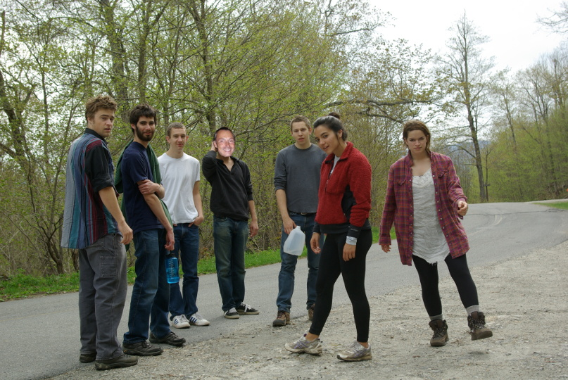
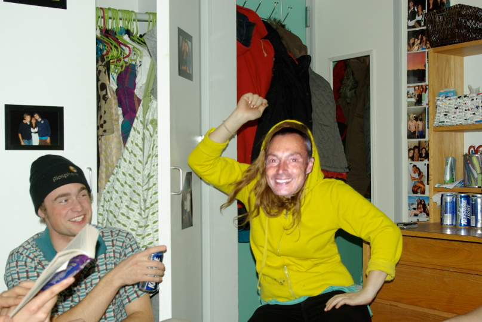
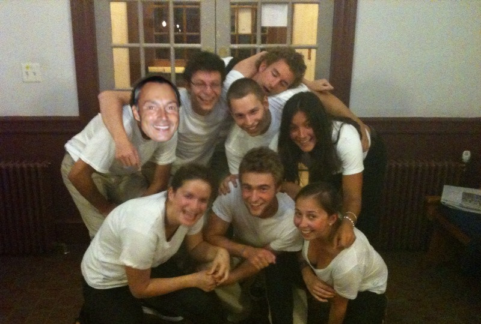
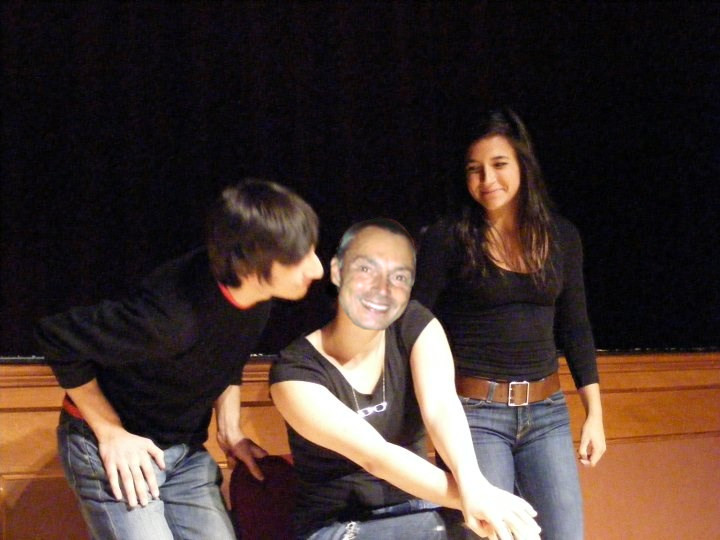
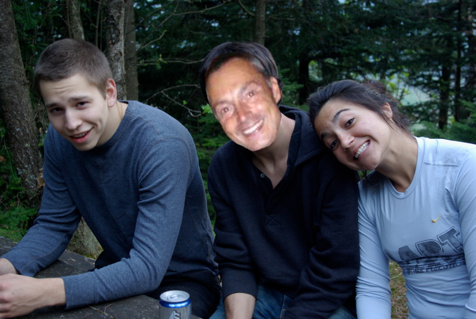
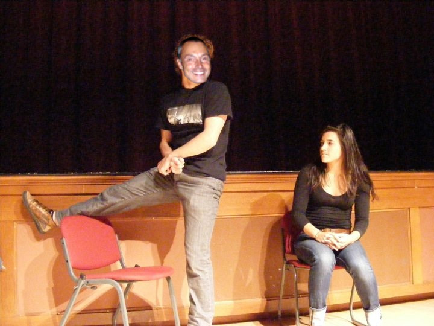
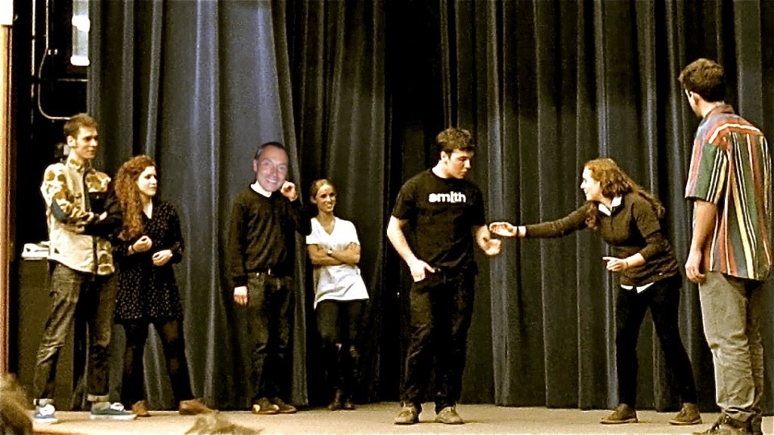
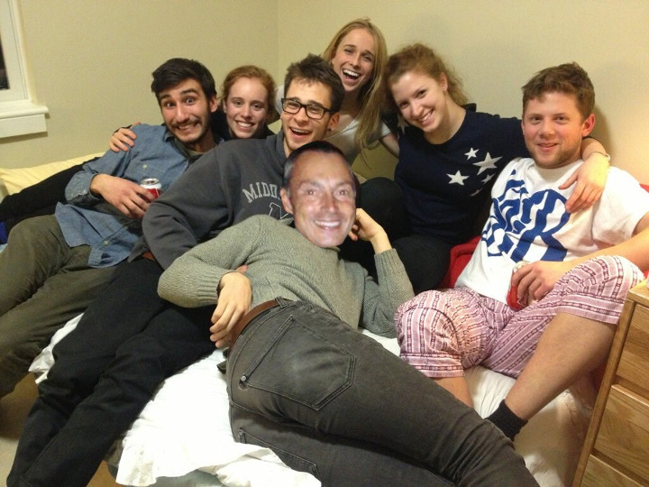
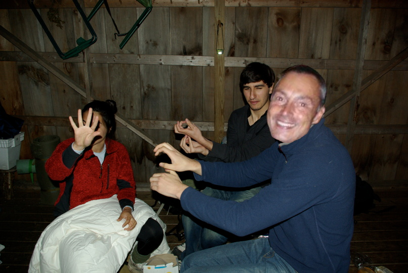
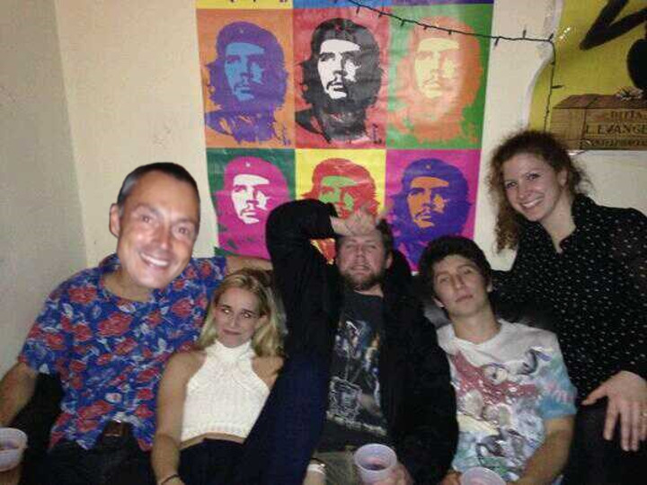

# **Comedic Cowboy**

## A Reinterpretation of Middlebrow's Early Years
## with Jim Limperis

**On a cold February week in 2011, Middlebrow was faced with a dilemma. Though the group was on tour, they had encountered a *once in a generation* comedic talent in a small New England town.**

**True, his improvisation skills were raw, but his work with props and thousand watt smile made up for that a thousand-million times over.**

## But... There was the whole thing of Middlebrow being for Middlebury students.

## And... There was his familial relationship with a current member.

## **AGAINST OUR BETTER JUDGMENT**
**we decided not to take him on as a full Middlebrow member. We made a mistake that day. Let's imagine how Middlebrow might have looked if we'd gotten it right...**

Jim's initiation! Little did he know what this band of hoodlums had in store for him

Jim's "long hair don't care phase" a requisite style for Middlebrow's male members

Jim relaxing w/co before his first show!

Alyssa super proud of Jim's character commitment

The Limperi can smile harder than anyone! Especially the Urquidi

Look, we get it, you guys have comedic chemistry. How about doing a scene with someone else?

Jim's a little skeptical of the prop work here. Hopefully its just a long cup.

And fit too!

Jim teaching the group deconstructed puppet prov. Or making shadow puppets

Jim leading the next generation of Brau

### **Note:** 

**We tried to find a picture of Jim not smiling. It was impossible. Sending you lots of love,**

**Middlebrow**
